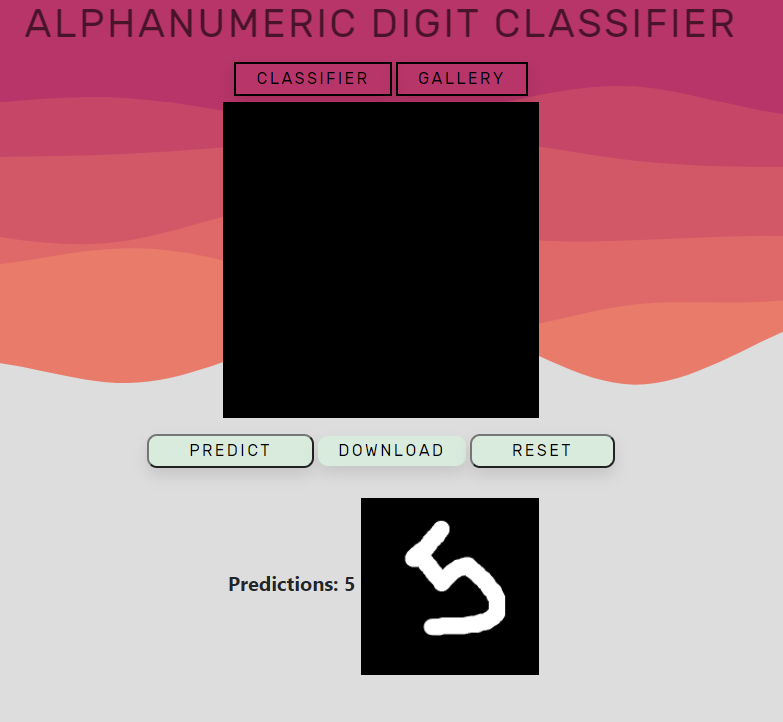

# Kaerebrum-Public
Kaerebrum - Machine Learning Module build with python using numpy

The Module is built from scratch using numpy.
Current completed algorithms that can be utilized are
1. Neural Network
2. Decision Tree
3. Regression 

<b>Tip:</b> Use blue boxes (alert-info) for tips and notes. 
If it’s a note, you don’t have to include the word “Note”.

&#reference_number

***

