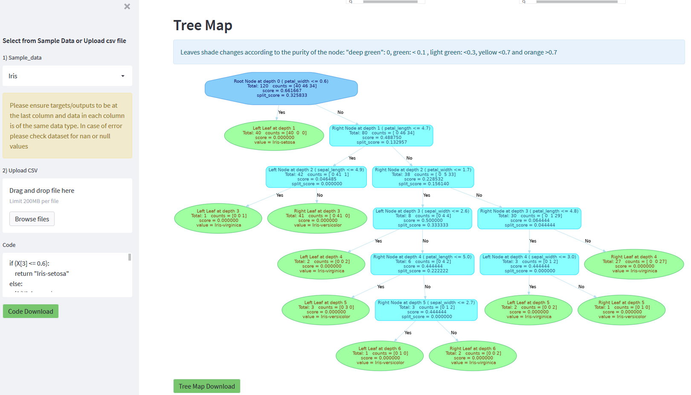

# Kaerebrum-Public
### Kaerebrum - Machine Learning Algorithm Module build with python using numpy

The Module is built from scratch using numpy.

There are implementation examples and demos created with jupyter notebook to  showcase its use.
There are also a couple of projects completed using the module to serve as the machine learning component.

Current completed algorithms that can be utilized are
1. Neural Network
    - [Demo Notebook with Augemented Mnist](https://github.com/Kaelancode/Kaerebrum-Public/blob/main/Augment%20Mnist%20with%20Kaerebrum.ipynb)
    - [Demo Notebook benchmark Kaerebrum with KERAS](https://github.com/Kaelancode/Kaerebrum-Public/blob/main/Demo%20Kaerebrum%20Neural.ipynb)
3. Decision Tree
4. Regression 

<h3> align='center' Projects with Kaerebrum </h3>

***
[Link to Digit Classification App](https://kaemnist.herokuapp.com/)

***
[Link to Decision Tree Code Map Generator](https://kaerubrumtree.herokuapp.com/)

